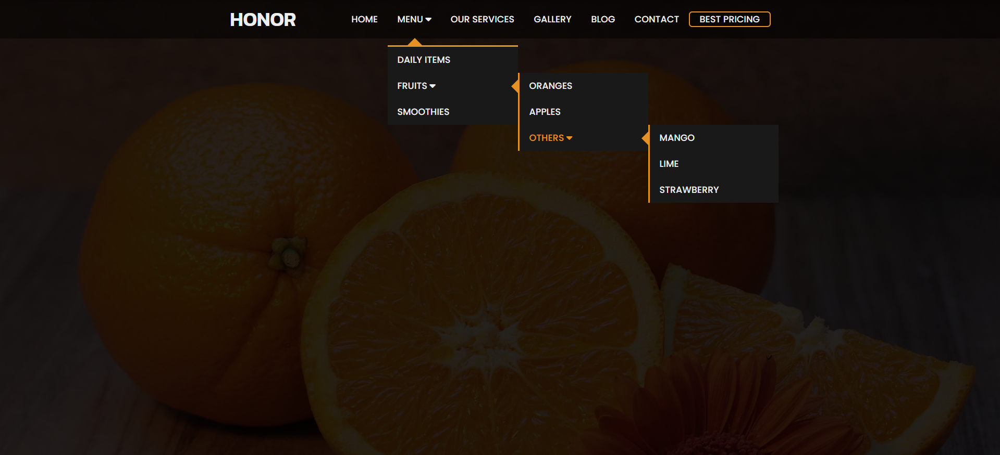
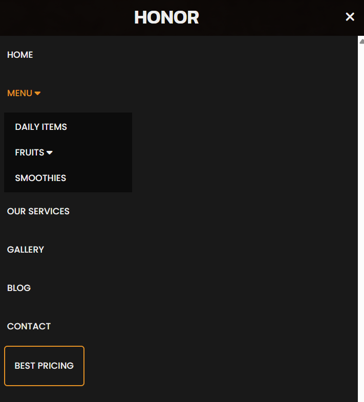

# 🍊 Responsive Multilevel Navbar

A responsive, multi-level dropdown navigation bar built using **HTML**, **CSS**, and **JavaScript**. Designed with smooth transitions, support for deep nested menus, and a mobile-friendly hamburger toggle.

## ✨ Features

- Fully responsive design
- Multi-level dropdown menus
- Smooth hover animations
- Mobile hamburger menu with toggle icons

---

## 📸 Screenshots

### 💻 Desktop View

### 📱 Mobile View (Expanded Menu)

## 🛠 Technologies Used

- HTML
- CSS
- JavaScript 
- Font Awesome (for icons)
- Google Fonts: Kanit, Poppins